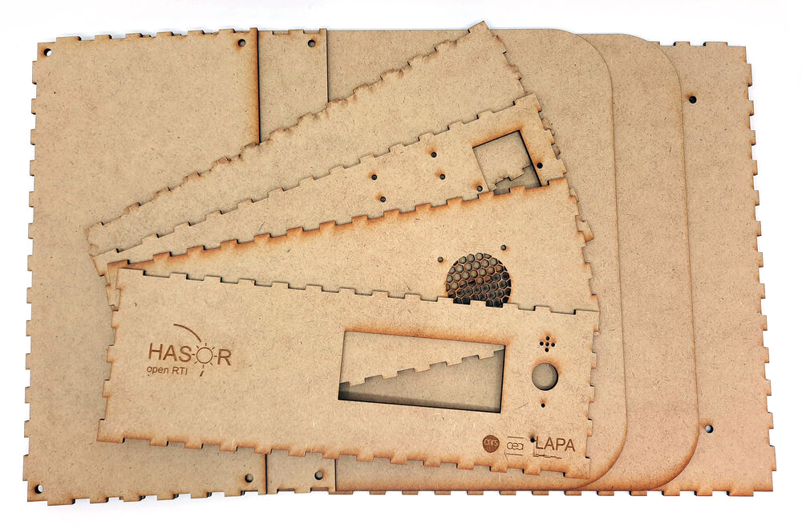

The box has a **29x29cm footprint** and is made with **3mm MDF wood** sheets. You can laser cut it on **300x600mm** sheets, suitables for most laser cutters:

- 4 pieces for sides
- 1 top and one bottom layers
- Top plate constituted by 2 layers

The vector files are available here, or in the github repository under ***lasercutter*** folder.

{}

*4 sides of the box*

*A montage of the top/bottom and 2 parts of the top plate*

The top face and plate can be **unscrewed for maintenance**.

*Wood sheet during laser cutting*

Once laser cutted, all the part are fixed together with **wood glue**.

*Box without cover*

