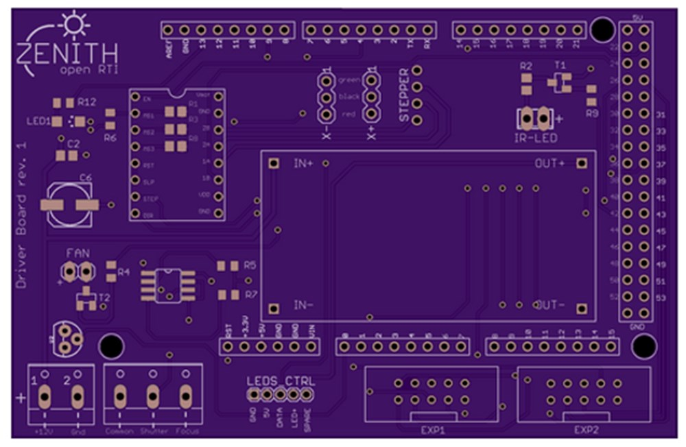
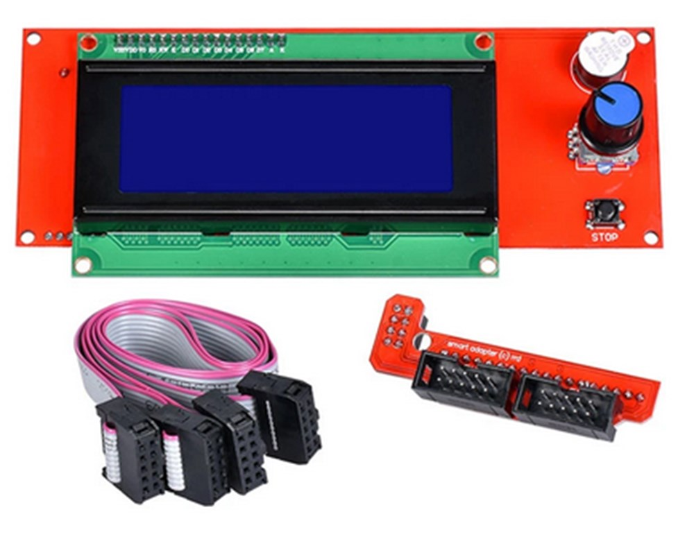

The main part of this shield are:
- The connector for the RepRap LCD. It has been choosen for it's availability, low price and integrated Knob for user interface.
- A stepper motor driver: It translate arduino orders to rotation of the stepper motor
- Voltage regulation holder: You can choose with potentiometer the voltage needed for your LED model
- Connector for endstop sensor: The sensor is used during "homing" to sense the zero position of the harm
- Connector for LED pcb chain
- A solid state relay to trigger the camera through wire
- A connector for IR LED to remotely trigger compatible cameras

