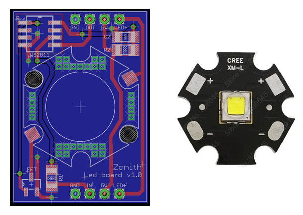

The 6 leds boards are chained and connected together with only 4 wires:

- [GND,DATA_IN,5V,LED+] on one side
- [GND,DATA_OUT,5V,LED+] on the other side

A **WS2811 RGB driver chip** receive the on-off order from arduino and activate a **mosfet** that will switch on the **high power LED**. Only one output of this chip is used on our version, but it can control as easily an **high power RGB led** for multispectral RTI. This chip is the one inside ws2812b leds strip and allow an long chain of leds to be adressed individually. The use of this board allow us add more leds if needed.